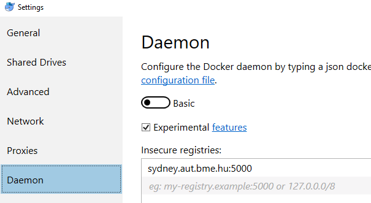

# Elasticsearch

## Célkitűzés

A labor gyakorlat célja, hogy a hallgató megismerkedjen a Docker
konténer alapú virtualizációs eszközzel, és az Elasticsearch – Kibana
rendszerek által nyújtott lehetőségekkel.

A labor során a hallgatók egy-egy példán keresztül ismerkednek meg a
Docker konténerek készítésével és több szolgáltatásból álló rendszerek
konténer alapú kezelésével. Megismerkednek továbbá az Elasticsearch
által nyújtott dokumentum tárolási és lekérdezési lehetőségekkel, és a
Kibana vizualizációs eszközeivel.

## Előfeltételek

A labor elvégzéséhez szükséges eszközök:

- Docker-compose start files from the [Docker folder](./Docker)
- Docker Community Edition

## Amit érdemes átnézned

- The material covered in course _Business intelligence_ related to the topic, including, but not limited to
  - The demo material covered during the semester <https://github.com/peekler/Business-Intelligence-Demos/tree/master/ELK>
- Elasticsearch documentation
  - <https://www.elastic.co/guide/en/elasticsearch/reference/current/search.html>
  - <https://www.elastic.co/guide/en/elasticsearch/reference/current/search-aggregations.html>

## Jegyzőkönyv

A labor feladatairól vezess jegyzőkönyvet. A sablon a tárgy honlapján
található. A közösen megoldott feladatoknál elég a végeredményről írni a
jegyzőkönyvbe, az önálló feladatoknál részletesebben magyarázz mit és
miért csináltál. Minden feladatnál a végleges eredményt mutasd be!

# Előkészület

A labor gépet **with Hypervisor** üzemmódban indítsd el! Bejelentkezés
után indítsd el a „Docker for Windows” programot, ami ezzel elindítja a
Docker szolgáltatást. Az értesítési területen („Notification Area”,
tálcán az óra mellett) megjelenő Docker ikonra jobbklikkelve ellenőrizd,
hogy Linux konténer van kiválasztva. Amennyiben nincs, akkor a
menüpontok között látod a „Switch to Linux containers…” opciót, erre
kattints rá.

Ha befejeződött a váltás (az ikon már nem animál), nyisd meg a Docker
tálcán levő ikonján jobb egérrel kattintva a „Settings” ablakot és azon
belül a „Daemon” fület. Ellenőrizd, hogy az „Insecure registries”
listában szerepel-e az alábbi URL: sydney.aut.bme.hu:5000. Ha nem, vedd
fel, és nyomd meg az Apply gombot.

# Egyszerű Docker konténer készítése

A feladat egy egyszerű python webszerver konténerizációja. Készítsen el
egy docker image-et, indítsa el a konténert, és ellenőrizze a webszerver
működését.

# Több szolgáltatásból álló szoftver használata

A feladat több szolgáltatásból álló szoftver használata docker
környezetben. Indítson el egy Redis szolgáltatást a már meglevő python
webszerver mellé docker compose eszköz használatával.

# Elasticsearch környezet felállítása

A docker compose eszköz segítségével konfigurálja és állítsa fel az
Elasticsearch – Kibana környezetet, majd ellenőrizze a működésüket az
Elasticsearch REST API-ja és a böngésző segítségével.

# Elasticsearch REST API használata

A feladat az Elasticsearch REST API-jának használatával dokumentumok
létrehozása, lekérdezése és keresések elvégzése. Ehhez először használja
a PowerShell Invoke-WebRequest (curl) parancsát, majd pedig a Kibana
„Dev Tools” felületét.

a) Hozzon létre egy dokumentumot, majd pedig kérdezze le, PowerShell
segítségével.

b) Kibanából hozzon létre egy indexet a további dokumentumok számára,
adjon hozzá egy dokumentumot és kérdezze is le azt. A bulk API
használatával tölte fel az indexet nagyobb mennyiségű adattal.

c) Ismerkedjen meg a search API használatával, majd válaszoljon a
következő kérdésekre:

<!-- -->

1.  Ki az öt legjobban fizetett ember?

2.  Ki az öt legjobban fizetett 18 és 30 év közötti ember a
    McDonald’s-nál?

3.  Férfiak vagy nők dolgoznak-e többen ezeknél a cégeknél? Van-e
    különbség az átlagfizetésük között?

4.  Mi a válasz az előző kérdésre különböző korcsoportok esetén?

# Kibana vizualizáció

A feladat a Kibana vizualizációs eszközeinek megismerése. Ezek
felhasználásának segítségével készítsen kimutatásokat a következő
kérdések megválaszolására.

1.  Hány embert vettek fel a cégek 2010-től 2016-ig havi bontásban?
    (_oszlopdiagram_)

2.  Mutassa meg a dolgozók nem és kor szerinti eloszlását!
    (_kördiagram)_

3.  Mutassa meg a dolgozók földrajzi eloszlását! (_térkép)_

# Elasticsearch Search API használata – önálló feladatok

Válaszoljon az Elasticsearch search API-ját felhasználva az alábbi
kérdésekre.

1.  Ki a három legfiatalabb személy?

2.  Ki a három legfiatalabb személy évi 80000 USD fölött a KFC-nél?

3.  Mi az átlagos életkor a különböző cégek esetében?

# Kibana vizualizáció – önálló feladatok

A Kibana vizualizációs eszközei segítségével készítse el a következő
kimutatásokat.

1.  Hogy alakult a felvett dolgozók átlagéletkora az évek során a
    különböző cégek esetén? (_oszlopdiagram_)\
    Érdemes lehet a diagram jobb átláthatóságához a „Metrics & Axes”
    menüpont alatt a „Mode”-ot „stacked”-ről „normal”-ra állítani – így
    a cégek egymás mellett és nem egymásra helyezve jelennek meg.

2.  Hogyan oszlanak el a dolgozók a különböző cégek között New York (NY)
    államban? (_kördiagram_)

3.  Milyen értékeket vesz fel a 18 és 30 év közöttiek átlagfizetése a
    különböző államokban? (_térkép_)
