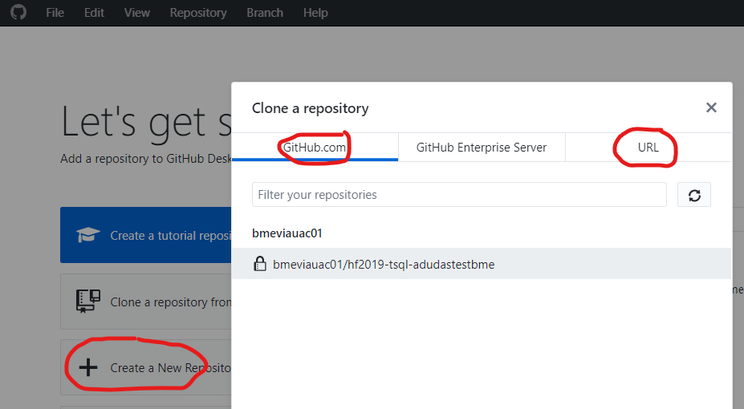
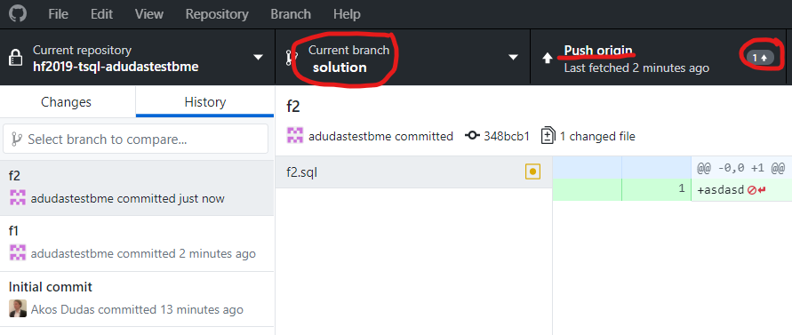
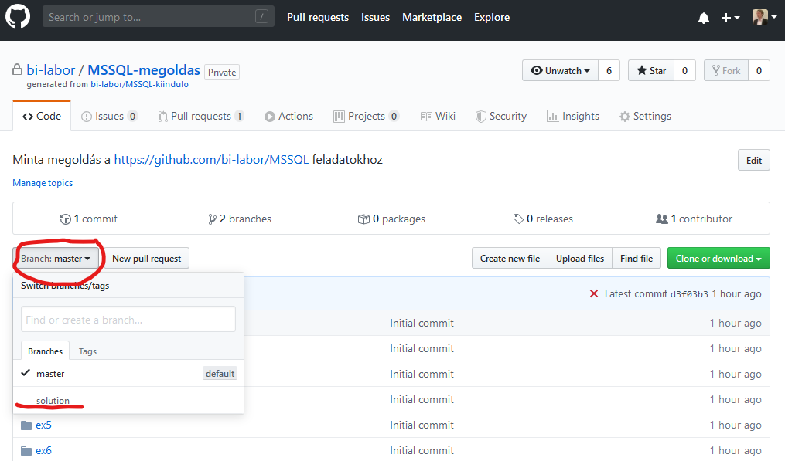

# Submitting your work

We are using GitHub for submitting the solutions. Your solution is to be submitted by uploading it to a GitHub repository, which repository is created through an URL included in the exercise. You must complete the exercises in this repository and upload the repository when finished. Your submission is completed by opening a _pull request_ and assigning it to your laboratory instructor.

> **IMPORTANT** The requirements here are mandatory. Submissions not following these steps are not evaluated.

## Short version, aka. TL;DR

Please read the detailed description too. This short summary is to give you an overview and a chance to verify your submission quickly.

1. You must complete your work in the repository created through the link in the exercise description.

1. You need to work on a new branch, not on master. You may add any number of commits to the working branch, and do not forget to push at the end.

1. You submit your solution for evaluation by opening a pull request and assigning it to your laboratory instructor.

## Starting your work: git checkout

1. [Register](https://github.com/join) a GitHub account, if you don't have one yet.

1. Open the link in the exercise description to create your repository.

1. If needed, authorize the _GitHub Classroom_ application to use your account data.

   

1. You will see a page where you can "Accept the ... assignment". Click the button.

   

1. Wait for the repository creation to finish. You will get the repository URL here.

   > The repository will be private. No one but you and the instructor will see it.

   

1. Open the repository webpage by following the link. You will need this URL, so remember it.

   

1. Clone the repository. You will need the repository git URL, which you can get from the repository webpage following the _Clone or download_ button.

   > You may use any git client. If you do not have a favorit yet, the simplest one is [GitHub Desktop](https://desktop.github.com/). You can list your repositories in this application directly from GitHub.

   

   If you are using console, the following command performs the clone (if the `git` command is available): `git clone <repository link>`

1. If the cloning is successful, **DO NOT START WORKING YET!** The solution should _not_ be committed to the repository `master` branch. Instead, create a new branch with the name `solution`.

   In GitHub Desktop, use the _Branch_ menu for creating a new one.

   

   If using console, use the following command: `git checkout -b solution`

1. Complete the exercises on this branch. You may have any number of commits and pushes.

   To commit using GitHub Desktop, first check if you are on the right branch. During the first push, the _solution_ branch needs to be published.

   

   When adding further commits, verify the branch. You can publish the commit using the _Push origin_ button. The little number of this buttons shows you how many commits need pushing.

   

   If you are using console, use the following commands:

   ```bash
   # Check the current branch and the files modified
   git status

   # Prepares all changes for commit
   git add .

   # Commit
   git commit -m "f1"

   # Push the new branch (first time)
   git push --set-upstream origin solution

   # Push futher commits
   git push
   ```

## Submitting the solution

1. When you are ready with the exercises, verify on the repository web page that you uploaded everything. You may need to switch branches.

   

   > Please do **NOT use** GitHub web file upload. If something is missing, add it to your local repository and commit and push again.

1. When you are truly ready, open a _pull request_.

   > This _pull request_ combines all changes you made, and shows us the final result. This helps the laboratory instructor to evaluate your submission more easily. This _pull request_ means you submit your solution, hence this step **cannot be omitted**.

   To open the _pull request_ you need to go to the repository's GitHub web frontend. If you pushed recently, GitHub will offer you to create the pull request..

   

   You may also open the _pull request_ from the menu at the top. It is important to specify the correct branches: `master` is the target into witch `solution` is merged.

   

1. When the _pull request_ is created, you will see a little number "1" on the _Pull request_ menu showing you that there is one open item there. **YOU ARE NOT FINISHED YET!**

   

1. The _pull request_ will trigger a preliminary evaluation. You will see the result in a comment in the _pull request_ thread.

   

   > This evaluation may differ from the image. And it may take some time.

1. If you are not satisfied with your work, you can make further changes. You only need to commit and push your changes continuing to work on the correct branch. Any changes pushed will re-trigger the evaluation of the _pull request_. We ask that you trigger **NO MORE THAN 5 evaluations**!

   > If you want to make changes to your submission and not have the re-evaluation run, you should **close the pull request**. When you are finished, you can open a new one instead.

1. **FINALLY**, when you are ready, assign the _pull request_ to your laboratory instructor. This step is considered as the submission of your work.

   

   > If you have no pull request, or it is not assigned to the instructor, we consider it work in progress and not submitted.

1. Now you are ready. After assigning the pull request, **make no further changes**. The instructor will evaluate the submission and close the pull request.

## Questions and complaints regarding the final result

Once your submission has been evaluated by the instructor, you may use the issue management feature of GitHub to raise questions or complaint. But remember, that in this case, you have support your question/complaint with proof (e.g. show how you tested your solution and prove that it worked). If you do not provide evidence to support your claim, we will not consider it.

To submit your question or complaint, open a new issue:

1. Go to the related repository on GitHub web frontend.

1. Click "Issues" and create a new one.

1. Describe the nature of your problem, and also include the steps you took to verify your solution.

1. Assign the issue to your instructor.

   

Once we checked it, we will give you feedback here.

## Possible issues and their resolution

If you are faced with a problem, read the followings.

If you still have an error, first, please seek to resolve it on your own. The laboratory instructors are available to help, but if you ask something that is clearly explained in the exercises, help will only be give in exchange for minus points.

#### You cannot find your repository

Go to www.github.com and after login you will see the list of your repositories on the left.

#### You got an email with "run failed" / the pull request contains "checks have failed"

After each commit you push, a minimal set of tests are executed for verification. This email tells you that these checks have failed.You must fix these. In the email you will find a link "View results". In the pull request, there is a "Details" link. You can check the logs of the execution here and look for red X-es marking the errors.

#### You do not know that is the problem in your solution

It is not our goal with the evaluation to explain the problems. It is part of your work to evaluate and test your own solution.

#### Do no not understand the error message received

The message is like from the actual execution of your work and comes from the used tools.

#### You forgot to branch / You cannot create the pull request

If you failed to create the branch for the solution, or created it too late, you will have a hard time opening the pull request. A pull request requires a branch with changes. To overcome this, follow the steps below.

1. Create the new branch. Switch to this branch.
1. You need to make a change on this branch. Add a meaningless change somewhere, like a newline, or an empty new file.
1. Commit this change and push this branch.
1. Now you can open the pull request. When opening the pull request add a note explaining that you used this approach.

It may be harder for the instructor to evaluate your submission due to not seeing the accumulated changes. This may be rewarded with minus points.

#### You do not know whom to assign the pull request

The laboratory instructor should have given you a GitHub name to assign to. If you do not know this, assign the pull request to `akosdudas`. In case this was not due to the error of the instructor, the extra work you have us do will be rewarded with minus points.

#### You finished your work but got no evaluation / grade

Did you: commit? push? open the pull request? assign it?

## Things you MUST NOT do

You may be familiar with git and pull requests and you may think of the following actions. We ask that you **DO NOT** do any of the followings as we consider them as cheating.

- **DO NOT** force push
- **DO NOT** edit the evaluation yaml files
- **DO NOT** use more branches or merge branches, only have a master and a solution branch
- **DO NOT** merge your pull request
- **DO NOT** delete anything from the pull request comments
