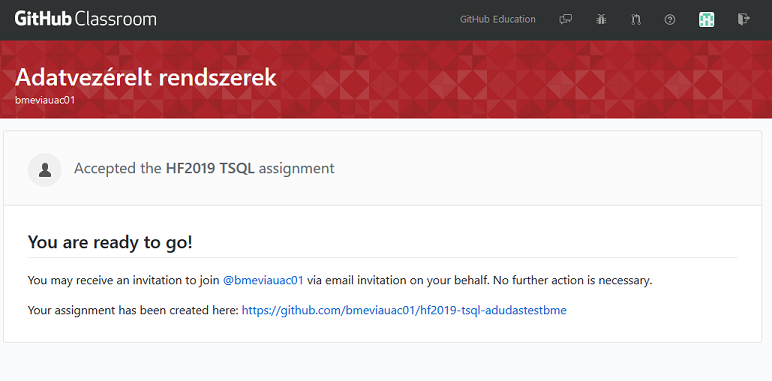
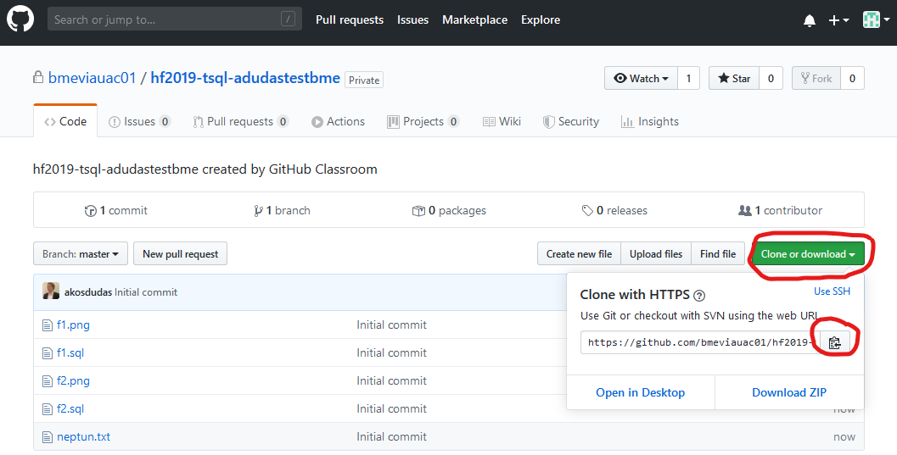
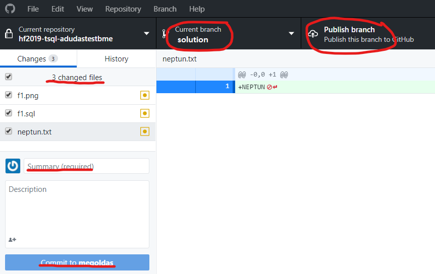
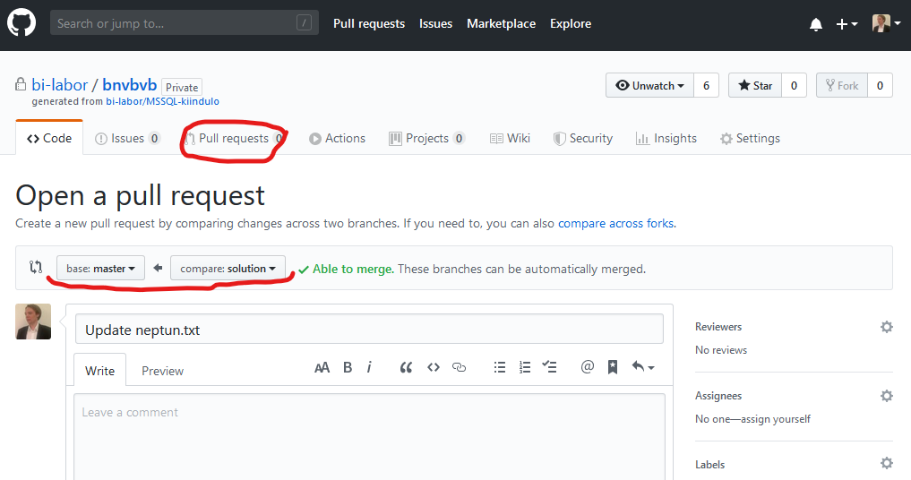
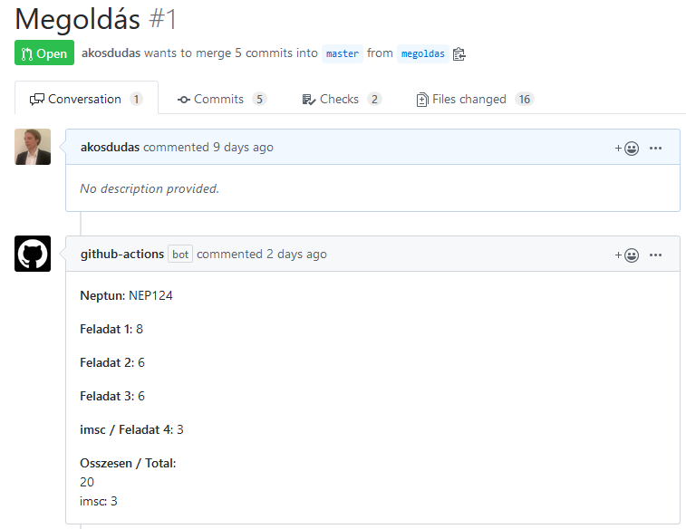
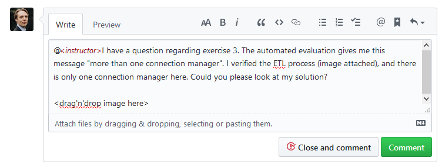

# Submitting your work (GitHub)

We are using GitHub to submit the solutions. You submit each laboratory in a GitHub repository that you will create through a provided link. The solution of the laboratory exercises are created within these repositories, then committed and pushed to GitHub. The submission is finished with a _pull request_ assigned to the laboratory instructor with GitHub name `akosdudas`.

!!! important "IMPORTANT"
    The submission requirements detailed below and mandatory. Submissions not following these guidelines are not graded.

## Short version, aka. TL;DR

The detailed description below shows the entire procedure. This summary is an overview of the whole process.

1. The lab exercises are solved in a dedicated GitHub repository created through a link in the exercise description.

1. Your solution is submitted on a new branch, not on master. You can create any number of committed on this branch. You need to push these commits to GitHub.

1. You submit your final solution through a pull request assigned to the laboratory instructor.

1. You can ask questions regarding the results and evaluation in the pull request comment thread. To notify your lab instructor use the @name annotation in the comment text.

## Starting your work: git checkout

1. [Register](https://github.com/join) a GitHub account if you don't have one yet.

1. Open the link in the exercise description to create your repository.

1. If needed, authorize the _GitHub Classroom_ application to use your account data.

    

1. You will see a page where you can "Accept the ... assignment". Click the button.

    

1. Wait for the repository creation to finish. You will get the repository URL here.

    !!! note "Note"
        The repository will be private. No one but you and the instructor will see it.

    

1. Open the repository webpage by following the link. You will need this URL, so remember it.

    

1. Clone the repository. You will need the repository git URL, which you can get from the repository webpage following the _Clone or download_ button.

    You may use any git client. The simplest one is [GitHub Desktop](https://desktop.github.com/) if you do not have a favorite yet. You can list your repositories in this application directly from GitHub.

    

    If you are using the console or the shell, the following command performs the clone (if the `git` command is available): `git clone <repository link>`

1. If the cloning is successful, **DO NOT START WORKING YET!** The solution should _not_ be committed to the repository `master` branch. Instead, create a new branch with the name `solution`.

    In GitHub Desktop, use the _Branch_ menu for creating a new one.

    

    If using the console, use the following command: `git checkout -b solution`

1. Complete the exercises on this branch. You may have any number of commits and pushes.

    !!! note "In university labs"
        Before you make your first commit, check whether your name and email address are properly configured. You can check this using the following commands.

        ```bash
        git config user.name
        git config user.email
        ```

        If the values are not correct, set your name and email address with the following commands executed in the repository directory. This will set the values for the repository. (It is recommended to set the email address to the one you use with GitHub.)

        ```bash
        git config user.name "John Doe"
        git config user.email "john@doe.org"
        ```

    !!! tip "At home"
        When working from home, you may want to set the name and email address globally using the `--global` switch in the commands above.

    To commit using GitHub Desktop, first check if you are on the right branch. During the first push, the _solution_ branch needs to be published.

    

    When adding further commits, verify the branch. You can publish the commit using the _Push origin_ button. The little number on this button shows you how many commits need pushing.

    

    If you are using the console, use the following commands:

    ```bash
    # Check the current branch and the files modified
    git status

    # Prepares all changes for commit
    git add .

    # Commit
    git commit -m "f1"

    # Push the new branch (first time)
    git push --set-upstream origin solution

    # Push further commits
    git push
    ```

## Submitting the solution

1. When you are ready with the exercises, verify on the repository web page that you uploaded everything. You may need to switch branches.

    

    !!! warning "GitHub web file upload"
        We recommend that you do not use the GitHub web file upload. If something is missing, add it to your local repository and commit and push again.

1. When you are truly ready, open a _pull request_.

    !!! tip "Why the pull request?"
        This _pull request_ combines all changes you made and shows us the final result. This helps the laboratory instructor to evaluate your submission more easily. This _pull request_ means you submit your solution; hence this step **cannot be omitted**.

    To open the _pull request_, you need to go to the repository's GitHub web frontend. If you pushed recently, GitHub will offer you to create the pull request.

    

    You may also open the _pull request_ from the menu at the top. It is important to specify the correct branches: `master` is the target into which `solution` is merged.

    

    When the _pull request_ is created, you will see a little number "1" on the _Pull request_ menu showing you that there is one open item there. **YOU ARE NOT FINISHED YET!**

    

1. The _pull request_ will trigger a preliminary evaluation. You will see the result in a comment in the _pull request_ thread.

    

    This evaluation may differ from the image. And it may take some time.

    If you need more information about the evaluation and the results, _GitHub Actions_ can provide you more. See the short guide [here](GitHub-Actions.md).

1. If you are not satisfied with your work, you can make further changes. You only need to commit and push your changes. Any changes pushed will re-trigger the evaluation of the _pull request_. We ask that you trigger **NO MORE THAN 5 evaluations**!

    !!! tip "Making further changes without running the evaluation"
        If you want to make changes to your submission and not have the re-evaluation run, you should **convert the pull request to draft**.

        

        This state means work in progress. You can commit and push freely. These will not trigger any evaluation. Once ready, you **must** change the state back: go to the bottom of the PR and click "Ready for review." This will set the PR back to its normal state and trigger an automated evaluation.

        

    !!! note "Maximum 5"
        Evaluations that fail due to transient errors, such as network problems, are not counted into the 5 evaluations. But if you trigger more evaluation by mistake, or on purpose, it will be sanctioned. You are required to **test your solution locally** before submitting it.

1. **FINALLY**, when you are ready, assign the _pull request_ to your laboratory instructor. This step is considered as the submission of your work.

    

    !!! error "Without pull request"
        If you have no pull request, or it is not assigned to the instructor, we consider it work in progress and not submitted.

    !!! success "Done"
        Now you are ready. After assigning the pull request, **make no further changes**. The instructor will evaluate the submission and close the pull request.

## Questions and complaints regarding the final result

If you have questions on concerns regarding the automated evaluation, use the pull request for communication with the instructor by asking questions via comments. To let the instructor know you have questions, please use `@akosdudas` [mention](https://help.github.com/en/github/writing-on-github/basic-writing-and-formatting-syntax#mentioning-people-and-teams) in the PR comment. This will automatically send an email notification.



!!! warning "Please provide proof"
    Please note that if you think the evaluation made a mistake, you must support your question/complaint with proof (e.g., show how you tested your solution and prove that it worked).
