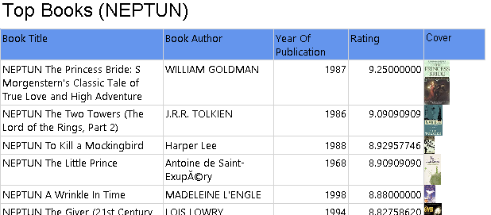

# Exercise 6: Create a report listing the highest rated books

1. Create a report that lists the **top 10 highest rated books** in a table.

   > The report should be edited in solution `ex6.sln` in file `books.rdl`.

   - The list should be in a table format displaying the title, author, publication year, average rating, and the cover image of the book (using the medium sized image URL from the dataset).

   - Use an _Image_ component from the toolbox. The image source should be _External_ in order to fetch it based on the URL.

   - The average rating should be computed by an SQL script. Ignore any book that does not have at least 20 ratings.

     > Include this sql script (a single sql statement) in file `ex6.sql`.

     The file should contain a single sql query. Do not include the database name, and do not include any `go` command either.

   - Make sure to calculate the rating appropriately: if the imported rating is of type integer, make sure to use decimal types when averaging the values!

   - Add a title to the report, and include your neptun code in the title.

   - The final report should look similar to this:

     

2. Include a screenshot of the report as `ex6.png`.

   Please make sure that the screenshot is taken such that it

   - includes entire window of Visual Studio, not just the report preview,
   - contains the date and time when the screenshot was taken (e.g. including the clock form the Start menu)
   - and includes the name of the machine you are working on (e.g. execute a `whoami` command from the command prompt).

## Submit your solution

See instructions in [exercise 1](exercise1.md) to submit your solution.
