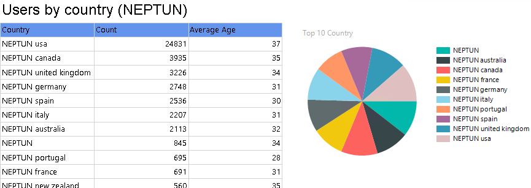
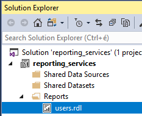
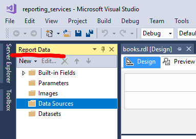
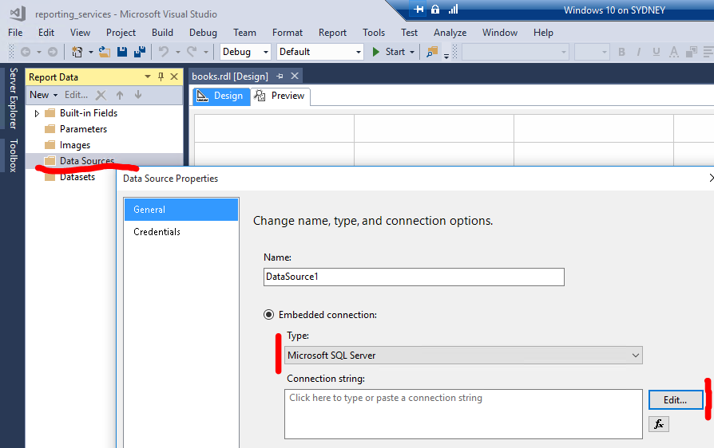
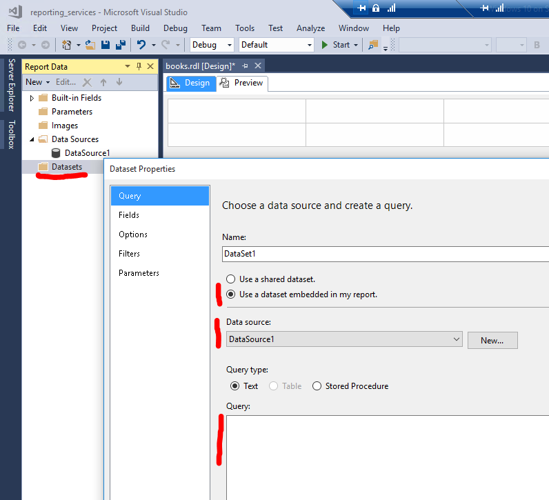
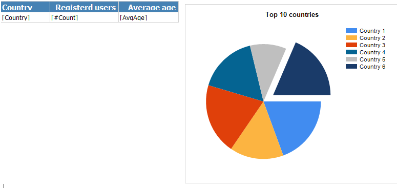
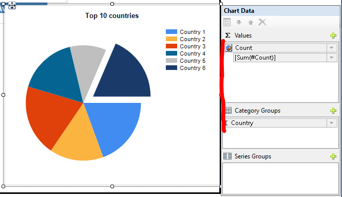

# Exercise 4: Report about users

Extend the provided Reporting Services project `ex4.sln` by modifying the project contents in place. You can find this solution in the root of the checked out git repository.

Create a report that summarizes from which country do our users come from. A table should list the number of users by country, along with the average age from the country, and a pie chart should display the number of users from the top 10 countries.

The final report should look similar to this:



1. Open the solution with Visual Studio, and open _users.rdl_ from _Solution explorer_.

    

1. Locate the _Report data_ toolbox. If you cannot find it, open it from the _View_ menu.

    

1. Add a new _Data source_ to the report by right-clicking the _Data sources_ folder in the _Report data_ window.

    - Chose the "Embedded connection" option.
    - Connect to _Microsoft SQL Server_.
    - Use the _Edit_ button to specify connection details. Use the same settings as before.

        

    - Switch to the _Credentials_ page and select the _Use Windows Authentication option_.

        

    - After the _data source_ is added, open its properties and verify the _Credentials_. You might need to set up this page again. (This seems to be a bug in Visual Studio.)

1. Add a new dataset by right-clicking the _Datasets_ folder in the _Report data_ window. The dataset specifies how to fetch the data we want to display. It will be an SQL query.

    - Chose "Use a dataset embedded in my report"
    - Select the data source from the dropdown. It is the data source created in the previous step.
    - The query should list the number of users and the average age for each country sorted descending according to the number of users. The query should also skip countries that are "outliers" having too few (<50) users.
    - Write the query as text as follows

         ```sql
         select Country, count(*) as Count, avg(Age) as AvgAge
         from BXUser
         where Country is not NULL and Country<>''
         group by Country
         having count(*) >= 50
         order by Count desc
         ```

    

1. Visualize the result in a table.

    - Add a table to the report surface by dragging one from the _Toolbox_.
    - Drag each field from the _Report data_ toolbox from under the _Dataset_ created above into the table.
    - Delete obsolete columns by right-clicking the table. There should be 3 columns: country, number of users, and average age.
    - Edit the header row to have meaningful column headers.

1. Add a pie chart by dragging a _Chart_ item from the _Toolbox_ next to the table.

    - The designer view of the report should be similar:

        

    - Chose a pie chart type.
    - Create a new dataset, similar to the one before, that returns only the **top 10** rows.
    - Open the _Chart data_ overlay by clicking the chart component. You need to click to a white area for this overlay to appear.
    - From the newly created dataset display the _Count_ field as the _Values_ and the _Country_ field as _Category groups_:

        

1. Add a title to the report, and **include your Neptun code in the title**. (See the sample report at the top.)

1. Preview the report by switching to the _Preview_ tab in Visual Studio.

!!! example "SUBMISSION"
    Include a screenshot of the report as `ex4.png`.

    Please make sure that the screenshot is taken such that relevant parts of the report are all visible (title, table, and diagram too). See the sample at the beginning of the exercise.
