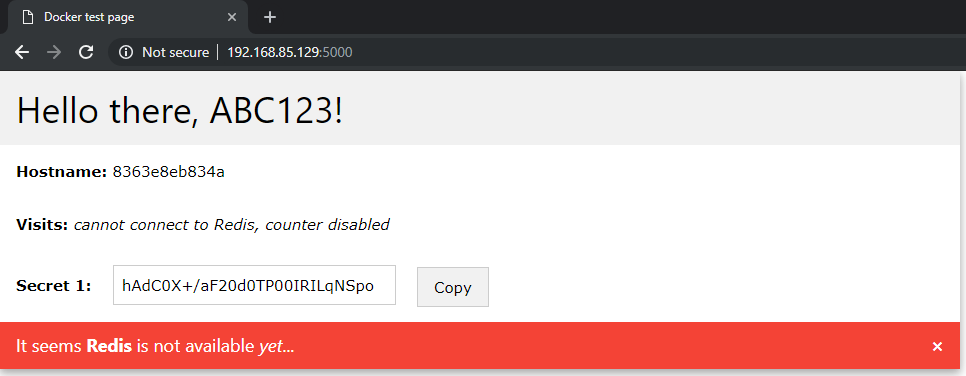

# Exercise 2: Building a _Docker_ image

> :memo: Locate the provided files in the `data\pyton_redis` folder. This folder contains a very simple Python web application. We are going to use this as base in the following two exercises.

The purpose of this exercise is to build a _Docker_ image from this _Python_web application, and try out running the container.

1. Start a text editor of your choice and create a file in this folder withthe name `Dockerfile`. The file's contents should be the following.

    ```dockerfile
    # Specify a base image that determines the starting state of our image
    FROM sydney.aut.bme.hu:5000/python:3.7.2-alpine

    # Set the working directory of the image to /app
    WORKDIR /app

    # Copy the contents of our current directory (the Python web app) into the image
    COPY . .

    # Install the required Python dependencies
    RUN pip install -r requirements.txt

    # Set the value of the 'NEPTUN' environment variable
    ENV NEPTUN ABC123

    # Specify the executable that should be run when the container is started
    CMD ["python", "app.py"]
    ```

    > :heavy_exclamation_mark: Make sure to set the `NEPTUN` variable to yourown _NEPTUN_ code instead of _ABC123_.

1. Open a _PowerShell_ window and navigate to the `data\pyton_redis` folder. Execute the following command here.

    ```powershell
    docker build -t bilab_web .
    ```

    This builds the docker image that we described earlier with the `Dockerfile`. The `-t bilab_web` part tells _Docker_ the name of the resulting image, and the `.` tells it where it can find the files we would like to use (_current folder_).

1. To make sure that the build succeeded we can check the list of _Docker_ images with the following command.

    ```powershell
    docker image ls
    ```

    This shows a table of all the _Docker_ images on the system. If the build succeeded there should be a new one called `bilab_web`.

    

1. If everything seems OK, we can start a container from the image.

    ```poweshell
    docker run -d -p 5000:5000 bilab_web
    ```

    Here the `-p 5000:5000` part tells _Docker_ to map the container's **5000** port (number on the **right** side) to the host computer's **5000** port (number on the **left** side).
    
    >  :information_source: Sometimes the **5000** port is already taken on the university laboratory computers. If this is the case, change the _host_ port to any other number, e.g. `-p 5001:5000`.

1. We can list the running containers using the following command.

    ```powershell
    docker ps
    ```

    

1. Open up a browser of your choice, and navigate to `localhost:5000`. If everything worked you should see the following page.

    

    * Make sure that the page prints out your _NEPTUN_ code. If it does not, you have to go back and change it in the `Dockerfile`.

    * Note that the _Hostname_ showed on the webpage is the _CONTAINER ID_ we saw when listing the running containers in the previous step.

    > :memo: If everything is working, save the `Dockerfile` in `exercise-2\Dockerfile` and copy the _Secret 1_ value in `exercise-2\secret.txt`.

1. To stop the container, issue the following command — the `container_id` can be copied from the previous `docker ps` command's response.

    ```powershell
    docker stop container_id
    ```

    If you now enter `docker ps` you will no longer see the container. This, however, does only mean that the container is _stopped_ not _removed_. You can see the difference if you enter `docker ps -a`. To remove the container entirely, you have to enter the following command.

    ```powershell
    docker rm container_id
    ```

## Next exercise

Next is [exercise 3](exercise3.md).